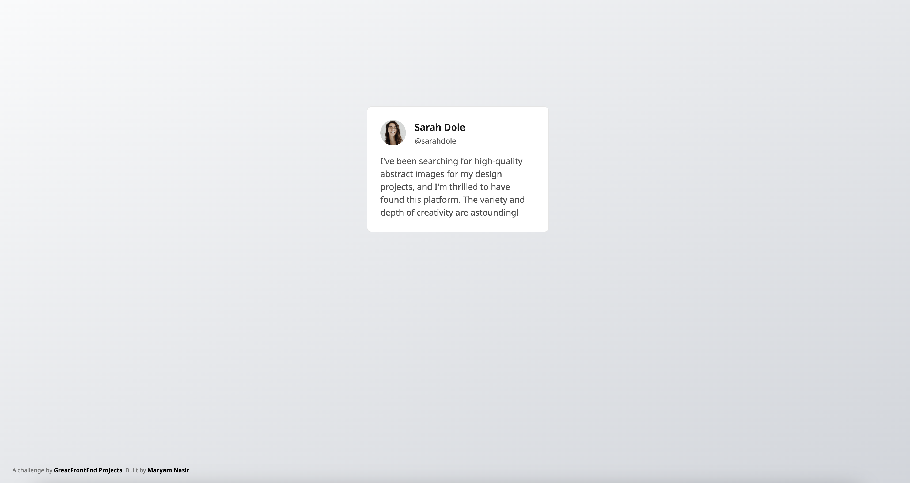

# Testimonial Card - GreatFrontEnd Project

## Project Overview

This testimonial card is a solution to the starter project taken from GreatFrontEnd. GreatFrontEnd Projects allow you to learn and practice your frontend skills by building real-world projects.

### Screenshot

## Tech Stack

- Semantic HTML5 Markup
- Tailwind CSS
- Flexbox

## Deployment

The project is live and can be accessed [here](https://maryam-nasir.github.io/gfe-testimonial-card).

## Author

- LinkedIn - [Maryam Nasir](https://www.linkedin.com/in/maryam-nasir/)
- Frontend Mentor - [@maryam-nasir](https://www.frontendmentor.io/profile/maryam-nasir)
- Twitter - [@maryamnasir555](https://twitter.com/maryamnasir555)
